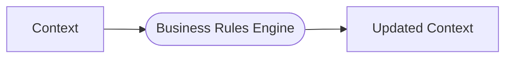
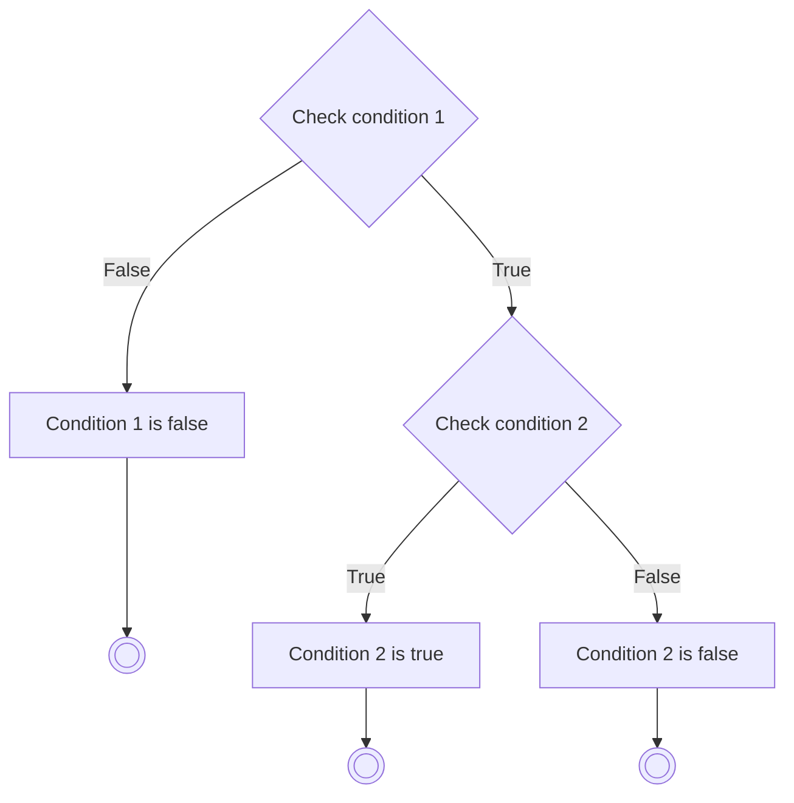

# Business Rules Engine (BRE)

A flexible and extensible Business Rules Engine (BRE) implemented in Go. This engine allows you to define and execute complex business rules using a YAML-based rules definition. The engine evaluates the conditions specified in the rules and modifies the context object based on the actions defined for each condition, allowing you to store and manipulate data throughout the rule execution process.



## Features

- Define flexible business rules using a declarative YAML syntax and javascript
- Execute rules based on specified conditions and actions
- Inject custom Go functions to extend the functionality of the rules engine
- Provide a debug callback function to log and monitor the execution of rules
- Terminate rule execution based on specific conditions
- Update the context during rule execution to store and manipulate data

## Usage

To use the Business Rules Engine (BRE) module in your Go project, you can import it using Go Modules:

```go
import "github.com/aleybovich/yabre"
```

1. Define your business rules in a YAML file. Here's an example (more below):

   ```go
   yamlData := `
   conditions:
     weight_less_500:
       default: true
       description: Check if a condition is met
       check: |
         function check_condition() {
           return context.Weight < 500;
         }
       true:
         description: Perform an action if the condition is true
         action:
           function: |
             function check_condition_true() {
               context.Result = "Condition met";
             }
         terminate: true`
   ```

2. Create a context struct that holds the necessary data for your rules:

   ```go
   type MyContext struct {
       Value  string `json:"value"`
       Result string `json:"result"`
   }
   ```

Note: context is `interface{}` so it can be any type of variable. `Struct` type makes sense in most scenarios.

3. Initialize the rules runner with your YAML file and context:

   ```go
   context := MyContext{Value: "Valid"}
   runner, err := yabre.NewRulesRunnerFromYaml(yamlData, &context)
   if err != nil {
       // Handle the error
   }
   ```

4. Execute the rules:

   ```go
   // No need to specify default starting condition `weight_less_500` as it's marked a s such in YAML data
   updatedContext, err := runner.RunRules(&context, "")
   if err != nil {
       // Handle the error
   }
   ```

5. Access the updated context to retrieve the results:

   ```go
   fmt.Println(updatedContext.Result)
   ```

## Building the YAML Rules File

The YAML rules file defines the conditions and actions that make up your business rules. Here's a guide on how to structure your YAML file:

```yaml
conditions:
  condition_name:
    default: true
    description: A brief description of the condition
    check: |
      function condition_name() {
        // JavaScript function that checks the condition
        // Return true if the condition is met, false otherwise
        // You can access the context using the 'context' object
      }
    true:
      description: A brief description of the action to perform if the condition is true
      action:
        function: |
          function condition_name_true() {
            // JavaScript function to execute if the condition is true
            // You can modify the context here
          }
      next: next_condition_name # Optional: The name of the next condition to evaluate
      terminate: true # Optional: Set to true to terminate rule execution
    false:
      description: A brief description of the action to perform if the condition is false
      action:
        function: |
          function condition_name_false() {
            // JavaScript function to execute if the condition is false
            // You can modify the context here
          }
      next: next_condition_name # Optional: The name of the next condition to evaluate
      terminate: true # Optional: Set to true to terminate rule execution
```

### Key Components:

- `conditions`: The top-level key that contains all the conditions.
- `condition_name`: A unique name for each condition.
- `default`: (Optional) a default starting condition; only one condition may be set to `true`; if no condition has this property, then `startCondition` is required when calling `RunRules`. If neither is present, `RunRules` will return an error.
- `description`: A brief description of the condition or action.
- `check`: A JavaScript function that evaluates the condition. It should return `true` if the condition is met, and `false` otherwise. You can access the context using the `context` object. 
- `true`: The action to perform if the condition evaluates to `true`.
  - `action`: A JavaScript function to execute if the condition is true. You can modify the context here.
  - `next`: (Optional) The name of the next condition to evaluate after executing the action. Cannot be used together with `terminate`.
  - `terminate`: (Optional) Set to `true` to terminate rule execution after executing the action. Cannot be used together with `next`.
- `false`: The action to perform if the condition evaluates to `false`. It follows the same structure as `true`.

### Naming Conventions

Condition name should be lowercase alphanumeric symbols and `_` only. Ex. `weight_greater_500`

Javascript functions can have any unique valid names; anonymous functions are also allowed and prefferred.

You can define multiple conditions within the `conditions` block. The engine will evaluate the conditions starting from the specified `startCondition` when calling `RunRules`; if `startCondition` is not provided, the engine will look for a condition with `default` property that equals `true`.

Note that the JavaScript functions defined in the YAML file have access to the `context` object, which allows you to read and modify the context data during rule execution.


## Extending the Engine

You can extend the functionality of the rules engine by injecting custom Go functions using the `WithGoFunction` option. Here's an example:

```go
add := func(args ...interface{}) (interface{}, error) {
    a := args[0].(int64)
    b := args[1].(int64)
    return a + b, nil
}

runner, err := yabre.NewRulesRunnerFromYaml("rules.yaml", &context, yabre.WithGoFunction("add", add))
```

In your YAML rules file, you can then use the `add` function:

```yaml
conditions:
  check_sum:
    description: Check the sum of two numbers
    check: |
      function check_sum() {
        const result = add(2, 3); // usign injected function inside the script
        return result === 5;
      }
    true:
      description: Sum is correct
      terminate: true
```

## Debugging

You can provide a debug callback function to log and monitor the execution of rules using the `WithDebugCallback` option:

```go
runner, err := yabre.NewRulesRunnerFromYaml("rules.yaml", &context, yabre.WithDebugCallback(
    func(data ...interface{}) {
      if len(data) > 0 {
        fmt.Printf("Debug: %v\n", data)
      } else {
        fmt.Println("debug callback data is empty")
      }
    }))
```

In your YAML rules file, you can use the `debug` function to log messages:

```yaml
conditions:
  check_debug:
    description: Check if debug function is called
    check: |
      function check_debug() {
        debug("Debug function called");
        return true;
      }
    true:
      terminate: true
```

## Evaluating decisions

The Business Rules Engine provides a `WithDecisionCallback` option that allows you to specify a callback function to be invoked whenever the engine makes a decision during rule execution. This callback function receives a message and optional arguments providing insights into the decisions made by the rules engine.

To use the decision callback, you can initialize the rules runner with the `WithDecisionCallback` option:

```go
runner, err := yabre.NewRulesRunnerFromYaml(yamlData, &context, yabre.WithDecisionCallback(
    func(msg string, args ...interface{}) {
        fmt.Printf("Decision: %s\n", fmt.Sprintf(msg, args...))
    }))
```

In this example, the callback function simply logs the decision message. You can customize the callback function to handle the decision information in any way that suits your needs, such as logging to a file, sending notifications, or updating a monitoring system.

The decision callback is invoked at various points during rule execution, such as when a condition is evaluated, an action is executed, or a termination point is reached. The callback function receives a message string that describes the decision, along with optional arguments that provide additional context.

By utilizing the decision callback, you can gain visibility into the decision-making process of the rules engine, track the flow of execution, monitor and analyze the behavior of your business rules engine, and understand and optimize the decision-making process, which can be particularly useful for debugging, auditing, or monitoring purposes.

Please note that the decision callback is an optional feature, and you can choose to omit it if you don't require detailed insights into the rule execution process.


## Generating Mermaid Flowcharts

The Business Rules Engine module provides a convenient way to generate Mermaid flowcharts from your YAML rules file. This allows you to visualize the flow of your business rules and understand the decision-making process.

To generate a Mermaid flowchart from your YAML rules, you can use the `ConvertToMermaid` function:

```go
yamlString := `
conditions:
  check_condition_1:
    description: Check condition 1
    check: |
      function check_condition_1() {
        return context.Value === "Valid";
      }
    true:
      description: Condition 1 is true
      next: check_condition_2
    false:
      description: Condition 1 is false
      terminate: true
  check_condition_2:
    description: Check condition 2
    check: |
      function check_condition_2() {
        return context.Value !== "Invalid";
      }
    true:
      description: Condition 2 is true
      action: |
        function check_condition_2_true() {
          context.Result = "Both conditions are true";
        }
      terminate: true
    false:
      description: Condition 2 is false
      terminate: true
`

mermaidCode, err := yabre.ConvertToMermaid(yamlString)
if err != nil {
    // Handle the error
}

fmt.Println(*mermaidCode)
```

In this example, we have a YAML rules file that defines two conditions: `check_condition_1` and `check_condition_2`. Each condition has a `true` and `false` branch, specifying the actions to be taken based on the condition's evaluation.

By calling the `ConvertToMermaid` function with the YAML string, it generates the corresponding Mermaid flowchart code. The generated code will look like this:

```
flowchart TD
    check_condition_1{Check condition 1}
    check_condition_1 -->|True| check_condition_2
    check_condition_1 -->|False| check_condition_1_false[Condition 1 is false]
    check_condition_1_false --> check_condition_1_false_end((( )))
    check_condition_2{Check condition 2}
    check_condition_2 -->|True| check_condition_2_true[Condition 2 is true]
    check_condition_2_true --> check_condition_2_true_end((( )))
    check_condition_2 -->|False| check_condition_2_false[Condition 2 is false]
    check_condition_2_false --> check_condition_2_false_end((( )))
```

Which creates a Mermaid chart like this:



You can render this Mermaid code using Mermaid-compatible tools or platforms to visualize the flowchart. For example, you can use online Mermaid editors or integrate Mermaid into your documentation or web pages.


## License

This project is licensed under the [LICENSE](LICENSE).