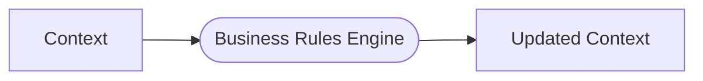
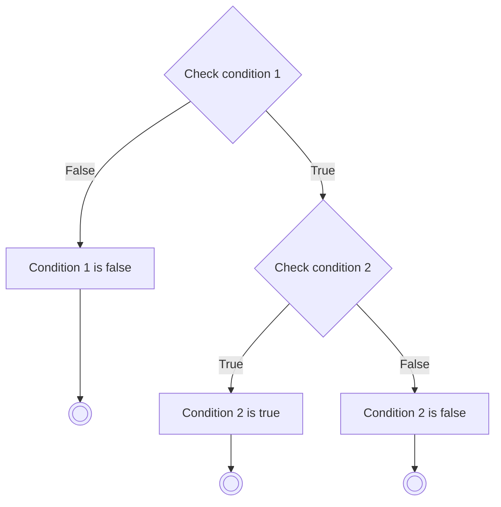

# Business Rules Engine (BRE)

A flexible and extensible Business Rules Engine (BRE) implemented in Go. This engine allows you to define and execute complex business rules using a YAML-based rules definition. The engine evaluates the conditions specified in the rules and modifies the context object based on the actions defined for each condition, allowing you to store and manipulate data throughout the rule execution process.


```mermaid
flowchart LR
    Context1[Context] --> BRE(["Business Rules Engine"])
    BRE --> Context2[Updated Context]

```

## Architecture

[High Level Architecture Diagram](./doc/ARCH.md)

## Features

- Define flexible business rules using a declarative YAML syntax and javascript
- Execute rules based on specified conditions and actions
- Multi-value branching (switch conditions) for routing based on string outcomes
- Inject custom Go functions to extend the functionality of the rules engine
- Provide a debug callback function to log and monitor the execution of rules
- Terminate rule execution based on specific conditions
- Update the context during rule execution to store and manipulate data
- Support for modular rule sets through a library system
- Ability to organize rules across multiple files with dependencies
- Structured execution trace for audit trails, debugging, and performance profiling

## Usage

To use the Business Rules Engine (BRE) module in your Go project, you can import it using Go Modules:

```go
import "github.com/aleybovich/yabre"
```

1. Define your business rules in a YAML file. Here's an example (more below):

   ```go
   yamlData := `
   name: simple-rules
   
   conditions:
     weight_less_500:
       default: true
       description: Check if a condition is met
       check: |
         function check_condition() {
           return context.Weight < 500;
         }
       true:
         description: Perform an action if the condition is true
         action:
           function: |
             function check_condition_true() {
               context.Result = "Condition met";
             }
         terminate: true
       false: 
         description: Perform an action if condition is false   
         action:
           function: |
             function check_condition_true() {
               context.Result = "Condition not met";
             }
         terminate: true
         `
   ```

2. Create a context struct that holds the necessary data for your rules:

   ```go
   type MyContext struct {
       Weight float64 `json:"weight"`
       Result string `json:"result"`
   }
   ```

Note: context is `interface{}` so it can be any type of variable. A `Struct` type makes sense in most scenarios.

3. Initialize the rules runner with your YAML file and context:

   ```go
   context := MyContext{Weight: 450}
   
   library, err := yabre.NewRulesLibrary(yabre.RulesLibrarySettings{
       BasePath: "./rules", // Directory containing rule files
   })
   if err != nil {
       // Handle the error
   }
   
   runner, err := yabre.NewRulesRunnerFromLibrary(
       library,
       "simple-rules", // Name of the rule set to use
       &context,
   )
   if err != nil {
       // Handle the error
   }
   ```

4. Execute the rules:

   ```go
   // No need to specify default starting condition `weight_less_500` as it's marked as such in YAML data
   updatedContext, err := runner.RunRules(&context, nil)
   if err != nil {
       // Handle the error
   }
   ```

5. Access the updated context to retrieve the results:

   ```go
   fmt.Println(updatedContext.Result)
   // Output: Condition met
   ```

## Modular Rule Sets

The Business Rules Engine now supports organizing rules across multiple files through a library system. This makes it easier to maintain complex rule sets and reuse common rules.

### Rule File Structure

Each rule file must include a `name` field to identify the rule set and can optionally specify dependencies:

```yaml
name: ruleset-name

# Optional dependencies on other rule sets
require:
  - common-rules
  - validation-rules

scripts: |
  function myFunction() {
    // JavaScript code
  }

conditions:
  # Your conditions here
```

### Using Rule Libraries

To use the modular rule system:

1. Create a Rules Library:

```go
// Create a rules library from a directory
library, err := yabre.NewRulesLibrary(yabre.RulesLibrarySettings{
    BasePath: "./rules",  // Directory containing your rule files
})
if err != nil {
    // Handle error
}

// Or with embedded files
//go:embed rules
var rulesFS embed.FS
library, err := yabre.NewRulesLibrary(yabre.RulesLibrarySettings{
    BasePath:   ".", // Path is relative to the filesystem root
    FileSystem: rulesFS,
})
```

**Note**: When both BasePath and FileSystem are specified, the BasePath is interpreted relative to the FileSystem's root

2. Create a rules runner from the library:

```go
context := MyContext{Weight: 450}
runner, err := yabre.NewRulesRunnerFromLibrary(
    library,        // The rules library
    "main-ruleset", // Name of the main rule set to use
    &context,       // Your context
    // Optional: WithDebugCallback, WithGoFunction, etc.
)
if err != nil {
    // Handle error
}

// Run rules as usual
updatedContext, err := runner.RunRules(&context, nil)
```

### Dependency Resolution

When loading a rule set, the engine automatically:
- Resolves and loads all dependencies
- Merges script sections from all rule sets
- Merges conditions (ensuring no duplicates)

This allows you to organize your rules logically, such as:
- Common utility functions in a shared rule set
- Domain-specific rules in specialized rule sets
- Main orchestration logic in a top-level rule set

## Rules Validation

The engine provides static validation to catch issues in rule sets at initialization time, before any rules are executed.

### Enabling Validation

Set `ValidateOnLoad: true` in your library settings to validate all rule sets during initialization:

```go
library, valResult, err := yabre.NewRulesLibrary(yabre.RulesLibrarySettings{
    BasePath:       "./rules",
})
if err != nil {
    // Fatal validation errors (e.g., circular dependencies) cause init to fail
    log.Fatalf("error while loading the rules: %v", err)
}

if len(valResult) != nil {
    log.Fatalf("rules validation failed")
}

// Non-fatal warnings (e.g., unreachable conditions) are available for inspection
for _, warning := range library.Warnings {
    log.Printf("rule warning: %s", warning)
}
```

### What Gets Validated

| Check | Severity | Behavior |
|-------|----------|----------|
| Circular condition dependencies (A → B → A) | Error | Library init fails |
| Circular `require` dependencies between rule sets | Error | Library init fails |
| Dangling `next` references to non-existent conditions | Error | Library init fails |
| Unreachable conditions (not referenced and not default) | Warning | Collected in `library.Warnings` |

## Building the YAML Rules File

The YAML rules file defines the conditions and actions that make up your business rules. Here's a guide on how to structure your YAML file:

```yaml
# Required: Unique name for this rule set
name: my-rule-set

# Optional: Dependencies on other rule sets
require:
  - common-rules
  - validation-rules

conditions:
  condition_name:
    default: true
    description: A brief description of the condition
    check: |
      function condition_name() {
        // JavaScript function that checks the condition
        // Return true if the condition is met, false otherwise
        // You can access the context using the 'context' object
      }
    true:
      description: A brief description of the action to perform if the condition is true
      action:
        function: |
          function condition_name_true() {
            // JavaScript function to execute if the condition is true
            // You can modify the context here
          }
      next: next_condition_name # Optional: The name of the next condition to evaluate
      terminate: true # Optional: Set to true to terminate rule execution
    false:
      description: A brief description of the action to perform if the condition is false
      action:
        function: |
          function condition_name_false() {
            // JavaScript function to execute if the condition is false
            // You can modify the context here
          }
      next: next_condition_name # Optional: The name of the next condition to evaluate
      terminate: true # Optional: Set to true to terminate rule execution
```

### Key Components:

- `name`: Required unique identifier for this rule set.
- `require`: Optional list of other rule sets this rule set depends on.
- `conditions`: The top-level key that contains all the conditions.
- `condition_name`: A unique name for each condition.
- `default`: (Optional) a default starting condition; only one condition may be set to `true`; if no condition has this property, then `startCondition` is required when calling `RunRules`. If neither is present, `RunRules` will return an error.
- `description`: A brief description of the condition or action.
- `check`: A JavaScript function that evaluates the condition. It should return `true` if the condition is met, and `false` otherwise. You can access the context using the `context` object. 
- `true`: The action to perform if the condition evaluates to `true`.
  - `action`: A JavaScript function to execute if the condition is true. You can modify the context here.
  - `next`: (Optional) The name of the next condition to evaluate after executing the action. Cannot be used together with `terminate`.
  - `terminate`: (Optional) Set to `true` to terminate rule execution after executing the action. Cannot be used together with `next`.
- `false`: The action to perform if the condition evaluates to `false`. It follows the same structure as `true`.

### Switch Conditions (Multi-Value Branching)

In addition to binary (true/false) conditions, you can define switch conditions that branch based on a string return value. This is useful when a condition has more than two possible outcomes (e.g., routing by risk tier, product type, or status code).

Set `type: switch` on the condition. The `check` function returns a string, and the `cases` map defines the branches:

```yaml
conditions:
  classify_risk:
    type: switch
    default: true
    description: Classify loan risk tier
    check: |
      function() {
        const score = context.CreditScore;
        if (score >= 750) return "low";
        if (score >= 650) return "medium";
        if (score >= 550) return "high";
        return "critical";
      }
    cases:
      low:
        description: Low risk - approve immediately
        action: |
          function() { context.Decision = "approved"; context.Rate = 0.04; }
        terminate: true
      medium:
        description: Medium risk - standard review
        next: standard_review
      high:
        description: High risk - enhanced review
        next: enhanced_review
      critical:
        description: Critical risk - reject
        action: |
          function() { context.Decision = "rejected"; context.Reason = "Critical risk"; }
        terminate: true
      default:
        description: Unrecognised tier
        terminate: true
```

**Key rules for switch conditions:**

- `type: switch` is required to activate multi-value branching
- The `check` function must return a string value
- Each key in `cases` maps to a branch (same semantics as binary `true`/`false` branches: `action`, `next`, `terminate`)
- The literal key `"default"` is the fallback when no other case matches
- If no case matches and there is no `default` case, execution terminates silently
- `true` and `false` branches are not allowed on switch conditions
- Validation warns when no `default` case is defined

Switch conditions work seamlessly with execution traces (`RunRulesWithTrace`), Mermaid export, and all validation checks (cycle detection, dangling references, unreachable conditions).

### Naming Conventions

Condition name should be lowercase alphanumeric symbols and `_` only. Ex. `weight_greater_500`

Javascript functions can have any unique valid names; anonymous functions are also allowed and preferred.

You can define multiple conditions within the `conditions` block. The engine will evaluate the conditions starting from the specified `startCondition` when calling `RunRules`; if `startCondition` is not provided, the engine will look for a condition with `default` property that equals `true`.

Note that the JavaScript functions defined in the YAML file have access to the `context` object, which allows you to read and modify the context data during rule execution.


## Extending the Engine

You can extend the functionality of the rules engine by injecting custom Go functions using the `WithGoFunction` option. Here's an example:

```go
add := func(a, b int) int {
    return a + b
}

// Using the library-based approach
library, err := yabre.NewRulesLibrary(yabre.RulesLibrarySettings{
    BasePath: "./rules",
})
if err != nil {
    // Handle error
}

runner, err := yabre.NewRulesRunnerFromLibrary(
    library,
    "my-rule-set",
    &context,
    yabre.WithGoFunction("add", add))
```

In your YAML rules file, you can then use the `add` function:

```yaml
conditions:
  check_sum:
    description: Check the sum of two numbers
    check: |
      function check_sum() {
        const result = add(2, 3); // using injected function inside the script
        return result === 5;
      }
    true:
      description: Sum is correct
      terminate: true
```

## Custom Go Functions

The Business Rules Engine now supports any function signature when extending the engine with custom Go functions.

### Usage

Simply define your custom Go function and add it to the BRE using `WithGoFunction`:

```go
func multiply(a, b float64) float64 {
    return a * b
}

// Using the library-based approach
library, err := yabre.NewRulesLibrary(yabre.RulesLibrarySettings{
    BasePath: "./rules",
})
if err != nil {
    // Handle error
}

runner, err := yabre.NewRulesRunnerFromLibrary(
    library,
    "my-rule-set",
    &context,
    yabre.WithGoFunction("multiply", multiply))
```

### Examples

#### Example 1: Function with multiple arguments and a single return value

```go
func concat(a, b string) string {
    return a + b
}

runner, err := yabre.NewRulesRunnerFromLibrary(
    library,
    "my-rule-set",
    &context,
    yabre.WithGoFunction("concat", concat))
```

In your YAML rules:

```yaml
conditions:
  check_concat:
    description: Concatenate two strings
    check: |
      function check_concat() {
        const result = concat("Hello, ", "World!");
        return result === "Hello, World!";
      }
    true:
      terminate: true
```

#### Example 2: Function with error handling

```go
func divide(a, b float64) (float64, error) {
    if b == 0 {
        return 0, errors.New("division by zero")
    }
    return a / b, nil
}

runner, err := yabre.NewRulesRunnerFromLibrary(
    library,
    "my-rule-set",
    &context,
    yabre.WithGoFunction("divide", divide))
```

In your YAML rules:

```yaml
conditions:
  check_divide:
    description: Divide two numbers
    check: |
      function check_divide() {
        const [result, err] = divide(10, 2);
        if (err !== null) {
          debug("Division error:", err);
          return false;
        }
        return result === 5;
      }
    true:
      terminate: true
```

By using `GoFuncWrapper`, you can write clear, strongly-typed functions while still seamlessly integrating them into your Business Rules Engine. 

## Debugging

You can provide a debug callback function to log and monitor the execution of rules using the `WithDebugCallback` option:

```go
library, err := yabre.NewRulesLibrary(yabre.RulesLibrarySettings{
    BasePath: "./rules",
})
if err != nil {
    // Handle error
}

runner, err := yabre.NewRulesRunnerFromLibrary(
    library,
    "my-rule-set",
    &context,
    yabre.WithDebugCallback(
        func(data ...interface{}) {
          if len(data) > 0 {
            fmt.Printf("Debug: %v\n", data)
          } else {
            fmt.Println("debug callback data is empty")
          }
        }))
```

In your YAML rules file, you can use the `debug` function to log messages:

```yaml
conditions:
  check_debug:
    description: Check if debug function is called
    check: |
      function check_debug() {
        debug("Debug function called");
        return true;
      }
    true:
      terminate: true
```

## Evaluating decisions

The Business Rules Engine provides a `WithDecisionCallback` option that allows you to specify a callback function to be invoked whenever the engine makes a decision during rule execution. This callback function receives a message and optional arguments providing insights into the decisions made by the rules engine.

To use the decision callback, you can initialize the rules runner with the `WithDecisionCallback` option:

```go
library, err := yabre.NewRulesLibrary(yabre.RulesLibrarySettings{
    BasePath: "./rules",
})
if err != nil {
    // Handle error
}

runner, err := yabre.NewRulesRunnerFromLibrary(
    library,
    "my-rule-set",
    &context,
    yabre.WithDecisionCallback(
        func(msg string, args ...interface{}) {
            fmt.Printf("Decision: %s\n", fmt.Sprintf(msg, args...))
        }))
```

In this example, the callback function simply logs the decision message. You can customize the callback function to handle the decision information in any way that suits your needs, such as logging to a file, sending notifications, or updating a monitoring system.

The decision callback is invoked at various points during rule execution, such as when a condition is evaluated, an action is executed, or a termination point is reached. The callback function receives a message string that describes the decision, along with optional arguments that provide additional context.

By utilizing the decision callback, you can gain visibility into the decision-making process of the rules engine, track the flow of execution, monitor and analyze the behavior of your business rules engine, and understand and optimize the decision-making process, which can be particularly useful for debugging, auditing, or monitoring purposes.

Please note that the decision callback is an optional feature, and you can choose to omit it if you don't require detailed insights into the rule execution process.

## Structured Execution Trace

For machine-readable audit trails and rule debugging, the engine provides `RunRulesWithTrace` which returns a `[]TraceEntry` alongside the updated context. Each entry records what happened at a single condition evaluation step:

```go
type TraceEntry struct {
    ConditionName string        // YAML key of the condition
    Description   string        // Human-readable description
    Result        bool          // true/false outcome of the check (for binary conditions)
    SwitchResult  string        // String outcome for switch conditions (empty for binary)
    HasAction     bool          // Whether the matched branch has an action defined
    NextCondition string        // Name of the next condition (empty if terminated)
    Terminated    bool          // Whether execution terminated at this step
    Duration      time.Duration // Wall-clock time for check + action (excludes downstream chain)
    Error         error         // Any error that occurred at this step
}
```

### Usage

```go
ctx, trace, err := runner.RunRulesWithTrace(&context, nil)
if err != nil {
    // Handle error — trace still contains entries up to the point of failure
}

for _, entry := range trace {
    fmt.Printf("[%s] result=%t action=%t duration=%v\n",
        entry.ConditionName, entry.Result, entry.HasAction, entry.Duration)
}
```

### Example Output

For a loan approval that passes all checks:

```
[check_primary_applicant]    result=true  action=false  next=check_applicant_age         duration=42µs
[check_applicant_age]        result=true  action=false  next=check_applicant_income      duration=38µs
[check_applicant_income]     result=true  action=false  next=check_applicant_credit      duration=35µs
[check_applicant_credit]     result=true  action=false  next=check_co_applicant          duration=33µs
[check_co_applicant]         result=true  action=false  next=check_debt_to_income_ratio  duration=31µs
[check_debt_to_income_ratio] result=true  action=false  next=check_loan_amount           duration=40µs
[check_loan_amount]          result=true  action=true   terminated                       duration=45µs
```

Note: `HasAction` is `true` only when the matched branch has an `action:` defined in the YAML. Most routing conditions only specify `next:` with no action, so `HasAction` is `false` for those.

### Use Cases

- **Compliance audit logs** — answer "why was this application rejected?" with a structured record
- **Rule debugging** — inspect the exact execution path without adding callbacks
- **Performance profiling** — identify slow conditions via the `Duration` field
- **Test assertions** — assert on the exact trace path in unit tests

### Coexistence with Decision Callback

`RunRulesWithTrace` works alongside `WithDecisionCallback`. Both fire independently — the callback emits formatted strings while the trace captures structured data.

### Thread Safety

`RunRulesWithTrace` is safe for concurrent use on the same `RulesRunner`. Each call allocates its own internal trace collector, so concurrent goroutines never share trace state.


## Generating Mermaid Flowcharts

The Business Rules Engine module provides a convenient way to generate Mermaid flowcharts from your YAML rules file. This allows you to visualize the flow of your business rules and understand the decision-making process.

To generate a Mermaid flowchart from your YAML rules, you can use the `ExportMermaid` function:

```go
yamlString := `
name: flowchart-example

conditions:
  check_condition_1:
    description: Check condition 1
    check: |
      function check_condition_1() {
        return context.Value === "Valid";
      }
    true:
      description: Condition 1 is true
      next: check_condition_2
    false:
      description: Condition 1 is false
      terminate: true
  check_condition_2:
    description: Check condition 2
    check: |
      function check_condition_2() {
        return context.Value !== "Invalid";
      }
    true:
      description: Condition 2 is true
      action: |
        function check_condition_2_true() {
          context.Result = "Both conditions are true";
        }
      terminate: true
    false:
      description: Condition 2 is false
      terminate: true
`

mermaidCode, err := yabre.ExportMermaid([]byte(yamlString), "check_condition_1")
if err != nil {
    // Handle the error
}

fmt.Println(mermaidCode)
```

In this example, we have a YAML rules file that defines two conditions: `check_condition_1` and `check_condition_2`. Each condition has a `true` and `false` branch, specifying the actions to be taken based on the condition's evaluation.

By calling the `ExportMermaid` function with the YAML string, it generates the corresponding Mermaid flowchart code. The generated code will look like this:

```
flowchart TD
    check_condition_1{Check condition 1}
    check_condition_1 -->|True| check_condition_2
    check_condition_1 -->|False| check_condition_1_false[Condition 1 is false]
    check_condition_1_false --> check_condition_1_false_end((( )))
    check_condition_2{Check condition 2}
    check_condition_2 -->|True| check_condition_2_true[Condition 2 is true]
    check_condition_2_true --> check_condition_2_true_end((( )))
    check_condition_2 -->|False| check_condition_2_false[Condition 2 is false]
    check_condition_2_false --> check_condition_2_false_end((( )))
```

Which creates a Mermaid chart like this:


```mermaid
flowchart TD
    check_condition_1{Check condition 1}
    check_condition_1 -->|True| check_condition_2
    check_condition_1 -->|False| check_condition_1_false[Condition 1 is false]
    check_condition_1_false --> check_condition_1_false_end((( )))
    check_condition_2{Check condition 2}
    check_condition_2 -->|True| check_condition_2_true[Condition 2 is true]
    check_condition_2_true --> check_condition_2_true_end((( )))
    check_condition_2 -->|False| check_condition_2_false[Condition 2 is false]
    check_condition_2_false --> check_condition_2_false_end((( )))
```

You can render this Mermaid code using Mermaid-compatible tools or platforms to visualize the flowchart. For example, you can use online Mermaid editors or integrate Mermaid into your documentation or web pages.


## License

This project is licensed under the [LICENSE](LICENSE).