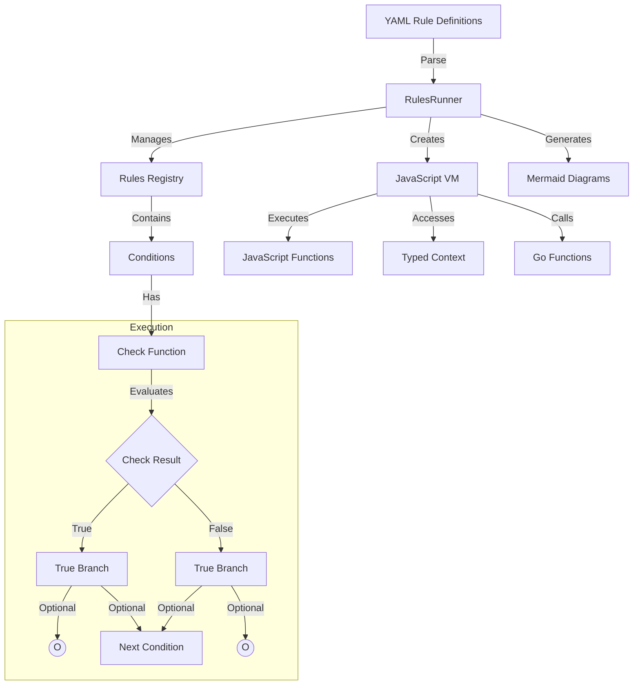

[Back to README](../README.md)

```mermaid

flowchart TD
    YAML[YAML Rule Definitions] --> |Parse| Runner[RulesRunner]
    Runner --> |Creates| VM[JavaScript VM]
    Runner --> |Manages| Rules[Rules Registry]
    
    Rules --> |Contains| Conditions[Conditions]
    Conditions --> |Has| Check[Check Function]
    
    
    VM --> |Executes| JSFuncs[JavaScript Functions]
    VM --> |Accesses| Context[Typed Context]
    VM --> |Calls| GoFuncs[Go Functions]
    
    Runner --> |Generates| Mermaid[Mermaid Diagrams]
    
    subgraph Execution
        Check --> |Evaluates| CheckResult{Check Result}
        CheckResult --> |True| TrueBranch[True Branch]
        CheckResult --> |False| FalseBranch[True Branch]
        TrueBranch --> |Optional| Term1((O))
        TrueBranch --> |Optional| NextCondition[Next Condition]
        FalseBranch --> |Optional| NextCondition
        FalseBranch --> |Optional| Term2((O))
    end
```

[Back to README](../README.md)